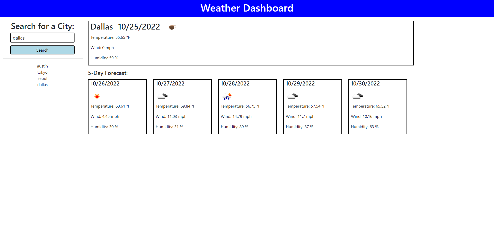

# jareds-weather-dashboard

## Description 

This application is a weather app that was built from scratch using HTML, CSS, and JavaScript. We also used APIs which is where we got the weather forecasts from. The user types in a city into the search bar and then the current weather and 5 day forecast will pop up. Under the search bar, the users search history will be displayed.

## Installation 

n/a

## Usage 

  
**Deploy application:** https://jkim011.github.io/jareds-weather-dashboard/
